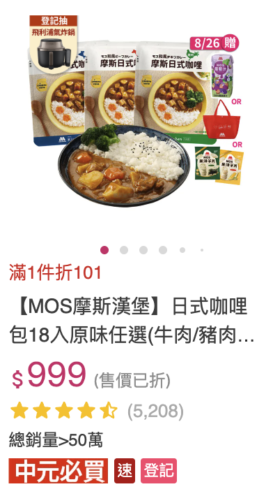
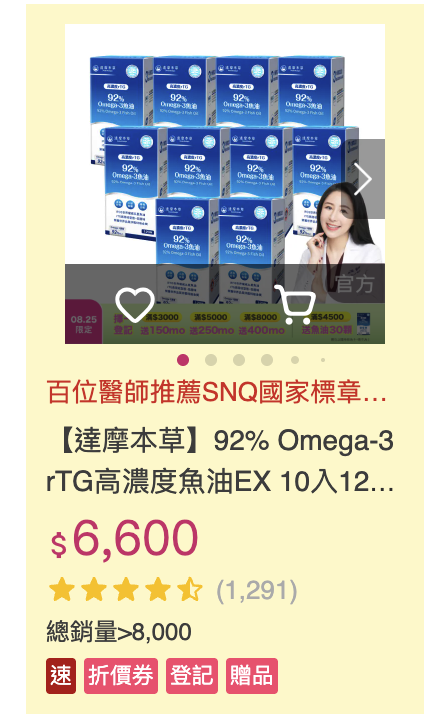
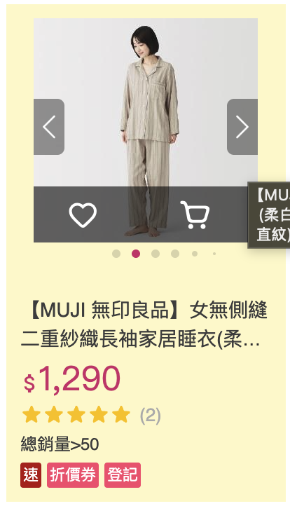
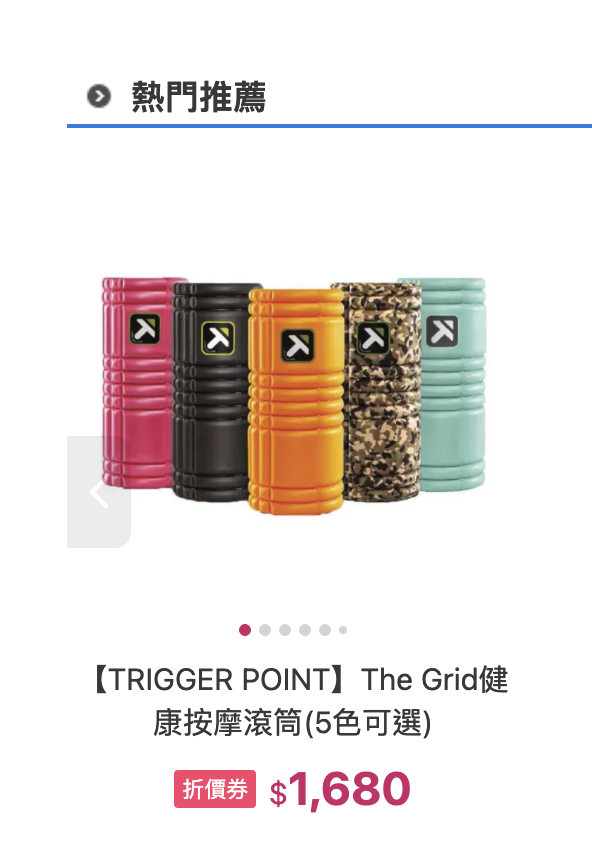
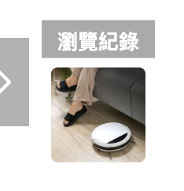

# Merchant Card Showroom MVP 討論紀錄

> 狀態：Phase 1 — Design / Planning  
> 題目：Frontend Take Home Evaluation — B. Merchant Card Showroom  
> 用途：保存需求理解、方案比較、工程決策與 AI 協作紀錄；本文不代表功能已完成。

## 1. 題目理解

原始題目要求分析真實 momo 電商商品卡類型，建立 Card Showroom，並至少完成一個商品卡。基本能力包括：

- 列出所有商品卡，或展示單一商品卡。
- 提供商品卡細節調整介面。
- 使用 Browser-side Persistence 保存調整結果。
- 提供一份 sample HTML，透過 Web Component 或 script 使用商品卡。

Bonus 聚焦於：

- Reusable Card Architecture。
- Schema / Plugin Extensibility。
- State Consistency Strategy。

評估不只看功能完成度，也會看架構與可維護性、Production / Delivery Thinking、取捨說明，以及 AI / Agent 協作與監督能力。

原始題目檔案：`Senior_Principal_Frontend_Takehome_Eval_Tw.pdf`。

## 2. 真實商品卡觀察

### 2.1 卡片類型盤點

| 類型 | 常見出現位置 | 主要特徵 | MVP 是否實作 |
| --- | --- | --- | --- |
| Search Grid Card | 搜尋結果、分類商品列表 | 直式高資訊密度；包含商品圖、促銷文案、名稱、價格、評論數、總銷量與 badges | 是，作為 MVP 唯一 variant |
| Recommendation Card | 首頁、商品頁推薦區 | 大圖置中、資訊層級較精簡，著重名稱、價格與單一促銷 badge | 否，已有參考圖，列為後續 registry 擴充項目 |
| History Compact Card | 商品詳情頁的瀏覽紀錄區 | 極小尺寸、以圖片識別為主，文字與互動資訊較少 | 否，已有參考圖，列為後續 registry 擴充項目 |

MVP 會列出三筆 `Search Grid Card` 商品卡實例，並讓使用者選取其中一張進行單卡預覽與編輯；「三筆商品卡實例」不代表實作三種 card variant。雖然只實作一種 variant，仍透過 registry 與 discriminated union 保留其他卡片類型的擴充邊界。

### 2.2 Search Grid Card 參考圖片

以下截圖來自真實 momo 搜尋／商品列表情境，作為 MVP 的視覺與資料欄位參考；實作不呼叫真實 momo API，也不直接使用真實線上商品圖片。Mock 商品圖允許由假圖網站產生，實際交付可使用遠端假圖 URL 或將生成結果保存為 repo 內靜態資產。

<table>
  <thead>
    <tr>
      <th>食品商品卡</th>
      <th>保健商品卡</th>
      <th>服飾商品卡</th>
    </tr>
  </thead>
  <tbody>
    <tr>
      <td></td>
      <td></td>
      <td></td>
    </tr>
  </tbody>
</table>

### 2.3 其他卡片類型參考圖片

<table>
  <thead>
    <tr>
      <th>Recommendation Card（熱門推薦）</th>
      <th>History Compact Card（瀏覽紀錄）</th>
    </tr>
  </thead>
  <tbody>
    <tr>
      <td></td>
      <td></td>
    </tr>
  </tbody>
</table>

觀察差異：

- Recommendation Card 以單一商品的大圖、輪播指示、置中名稱與價格形成主要閱讀順序，促銷資訊只保留一個 badge，資訊密度低於搜尋列表卡。
- History Compact Card 幾乎只保留圓角商品縮圖，並由外層「瀏覽紀錄」容器與導覽控制提供情境；卡片本身不承載完整名稱、價格與 badges。
- 兩者與 `Search Grid Card` 的資訊層級和版面責任明顯不同，適合在未來各自註冊為獨立 variant，而不是用大量條件判斷塞進同一個 renderer。

### 2.4 Search Grid Card 共同特徵

參考 [momo 官方搜尋結果](https://www.momoshop.com.tw/search/%E6%91%A9)，搜尋列表商品卡常見的資訊層級包括：

- 商品圖片。
- 簡短促銷賣點。
- 品牌化且可能很長的商品名稱。
- 總銷量。
- 現價與折後狀態。
- 星等視覺與評論數。
- 「速」、「折價券」、「登記」、「贈品」等促銷 badges。

三個樣本也呈現同一種卡片在不同商品資料下的可選狀態：

- 原價或「售價已折」等價格輔助資訊不一定存在。
- 促銷文案、badge 數量及組合會依商品改變。
- 圖片區可能包含輪播指示、左右切換、收藏與購物車操作。
- 商品圖本身可能已包含大量活動文字，因此卡片需處理不同圖片密度。
- 商品名稱與促銷文案都可能很長，需要穩定的截斷與版面高度策略。

因此 MVP 以評論數、總銷量及促銷 badges 作為主要可編輯資訊，使卡片語意更接近真實 momo 搜尋卡。圖片輪播、收藏狀態與完整購物車行為不列入核心資料模型；若畫面保留相關按鈕，只提供本地展示互動，不建立對應 domain。

## 3. 討論過的方案

### 3.1 卡片範圍

討論選項：

1. 一種卡片做完整。
2. 同時實作直式與橫式兩種變體。
3. 實作多種場景卡片。

決策：**先完成一種直式搜尋商品卡**。

理由：

- 1–2 小時的實作限制下，優先確保編輯、持久化、嵌入與測試形成完整垂直切片。
- 透過 registry 和 discriminated union 預留擴充點，仍可說明未來加入 `compact` 或 `live` 卡片的方式。
- 若有剩餘時間，再新增第二種 variant 驗證擴充能力，不將其列為 MVP 驗收條件。

### 3.2 儲存模式

討論選項：

1. 所有變更自動寫入 localStorage。
2. draft 與 persisted state 分離，使用者明確按 Save。
3. 自動與手動模式並行。

決策：**只保留手動儲存**。

理由：

- 編輯過程即時反映於預覽，但不會在輸入途中污染已提交資料。
- Save、Discard、Reset 的語意清楚，適合展示狀態一致性。
- 可明確測試「未儲存」、「已儲存」與「重新整理」三種狀態。

實作約束：

- Browser-side Persistence 統一由 Zustand `persist` middleware 管理。
- 編輯器與業務程式只呼叫 store action，不直接呼叫 `localStorage.getItem()`、`localStorage.setItem()` 或 `localStorage.removeItem()`。
- Storage key、schema version、rehydration 與 persisted state 合併規則集中在 Zustand persistence 設定。

### 3.3 外部嵌入方式

討論選項：

1. Web Component 包裝 iframe。
2. script 直接建立 DOM renderer。
3. 純 iframe。
4. 同一底層 renderer 提供 declarative 與 imperative API。

決策：**P0 先提供 imperative script API；基本門檻完成後才考慮 declarative Web Component。若兩種 API 都實作，必須共用同一個 iframe renderer。**

- P0 必做：`MomoCard.mount()`。
- 可選擴充：`<momo-product-card>`。
- 若提供兩者，必須共用 `createIframe()`，不維護兩份卡片 UI。

理由：

- Showroom 與外部頁面共用同一個 React `ProductCard`。
- iframe 隔離宿主頁面的 CSS，降低整合風險。
- 先用一種 consumer integration style 完成基本需求，再視剩餘時間補充 declarative API。
- 不需要在有限時間內增加 library bundler 或發佈 npm package。

已知代價：

- iframe 的高度同步、效能與跨來源通訊比直接 DOM 輸出複雜。
- Browser-side Persistence 受 origin 與第三方儲存政策影響。
- 這些限制應記錄在 README 的後續演進方向。

### 3.4 視覺方向

決策：**中性工具介面搭配 momo-inspired 商品卡**。

- Showroom 採乾淨的工程工具布局，突出選取、預覽與編輯流程。
- 商品卡使用 momo 粉紅色調與較高資訊密度。
- 不將整個 Showroom 仿造成電商網站，避免混淆工具與商品體驗的責任。

### 3.5 需求優先度與 Spec 開卡順序

排序原則：**先完成可獨立展示的基本需求閉環，再增加 Showroom 完整度與 Bonus 證據。** 每一階段都必須能獨立 demo，不以單純的前端層、狀態層或架構層作為水平切分。

#### 優先度判定

| 優先度 | 需求 | 判定理由 |
| --- | --- | --- |
| P0-1 | 展示並調整單一 `Search Grid Card` | 先交付一張可見、可操作的商品卡，滿足「至少一個卡片」的最低門檻 |
| P0-2 | Browser-side Persistence | 完成「調整 → 儲存 → 重新整理後仍保留」的基本閉環 |
| P0-3 | Sample HTML 載入商品卡 | 補齊外部 consumer 的基本需求；先完成一種 script API 即達基本驗收門檻 |
| P1-1 | 三筆商品清單、選取與個別保存 | 將最低交付擴充為完整 Showroom，但不阻擋 P0 基本閉環 |
| P1-2 | State Consistency Strategy | 強化 draft、persisted state、dirty guard、錯誤復原與跨頁同步的可預期行為 |
| P2-1 | Schema / Plugin Extensibility | 單一 variant 已可完成基本交付；擴充能力最後以可驗證的註冊邊界補強 |

`Reusable Card Architecture` 不獨立拆成後置卡片，而是從 P0 起套用到所有 Story 的共同驗收約束：

- Showroom 與 Sample HTML 共用同一個商品卡 renderer。
- 商品卡只接受可序列化設定，不直接讀取編輯器、儲存空間或路由狀態。
- 不維護兩份外觀相同但實作分離的商品卡 UI。
- 擴充能力不得犧牲 P0 基本閉環的交付順序。

#### Spec 拆分與依賴

```text
Epic：Merchant Card Showroom
├─ P0 Story 1：展示並調整單一商品卡（8 點）
├─ P0 Story 2：保存與復原商品卡設定（8 點）[依賴 Story 1]
├─ P0 Story 3：從 Sample HTML 載入商品卡（8 點）[依賴 Story 1、2]
├─ P1 Story 4：瀏覽並選取多筆商品卡（5 點）[依賴 Story 1、2]
├─ P1 Story 5：維持編輯、儲存與跨頁狀態一致（8 點）[依賴 Story 2、3、4]
└─ P2 Story 6：驗證商品卡 Schema 與 Variant 擴充能力（5 點）
```

Story 1–3 完成後即達基本需求交付門檻；Story 4–6 依序增加 Showroom 完整度與 Bonus 證據。外部嵌入在 P0 先以一種 script API 完成；第二種 consumer API 可在基本門檻完成後再加入，不阻擋 Story 3 驗收。

### 3.6 Mock 商品圖片來源

決策：**允許使用假圖網站產生商品圖片，但不使用真實 momo API 或真實線上商品資料。**

- 圖片內容只需能區分不同 mock 商品，不要求複製參考截圖中的品牌或促銷素材。
- 實際採用遠端假圖 URL 或將生成結果保存為 repo 內靜態資產，留待技術計畫決定。
- 若交付版本執行時依賴遠端圖片，載入失敗時仍須顯示可辨識的替代內容，且不可阻斷商品卡調整流程。

## 4. 最終 MVP 定義

### 4.1 使用者流程

1. 使用者進入 Showroom，看見三筆 mock 商品清單。
2. 選取一筆商品後，中央區域顯示卡片預覽。
3. 使用者在編輯面板修改內容或外觀，預覽立即反映 draft。
4. 使用者按 Save 後，通過驗證的設定才寫入 Zustand canonical state 與 localStorage。
5. 重新整理頁面後，卡片仍使用已儲存設定。
6. 使用者開啟 sample HTML，可看到 `MomoCard.mount()` 的使用程式碼與嵌入實例。
7. 在另一個 Showroom 分頁儲存變更後，已開啟的 sample/embed 透過 `storage` event 即時同步。

### 4.2 Showroom 介面

桌面採三區布局：

```text
┌──────────────┬──────────────────────┬──────────────────┐
│ 商品卡清單   │ 商品卡即時預覽       │ 細節調整面板     │
│              │                      │                  │
│ 三筆商品     │ draft renderer       │ Content          │
│ 選取狀態     │ toast interaction    │ Appearance       │
│              │                      │ Save / Discard   │
└──────────────┴──────────────────────┴──────────────────┘
```

窄螢幕依序堆疊清單、預覽與編輯面板，主要功能仍可用鍵盤操作。

### 4.3 商品資料

- 提供三筆同卡型、不同內容與促銷狀態的 mock 商品。
- 三筆商品分別持久化，而不是共用單一設定。
- 圖片使用假圖網站產生的 mock 圖片或 repo 內靜態資產；不呼叫真實 momo API，也不使用真實線上商品資料。

## 5. 資料與公開介面

### 5.1 商品卡設定

```ts
type ProductCardBadge = "速" | "折價券" | "登記" | "贈品";

type ProductCardConfig = {
  id: string;
  schemaVersion: 1;
  variant: "search-grid";
  content: {
    imageSrc: string;
    imageAlt: string;
    promotion: string;
    title: string;
    salesText: string;
    price: number;
    originalPrice?: number;
    reviewCount: number;
    badges: ProductCardBadge[];
  };
  appearance: {
    accentColor: string;
    borderRadius: number;
  };
};
```

### 5.2 Persistence 格式

```ts
type PersistedCardStore = {
  schemaVersion: 1;
  cards: Record<string, ProductCardConfig>;
};
```

- localStorage key：`momo-card-showroom:v1`。
- localStorage 是已提交資料的唯一 browser-side persistence backing store，但所有讀寫一律經由 Zustand `persist` middleware，不由應用程式直接操作。
- draft 只存在編輯器記憶體中，不寫入 localStorage。
- hydration 完成前顯示 loading state，並以 Zustand persistence 的 hydration 狀態或完成事件判斷，避免 SSR 預設值與 client persisted state 不一致。
- JSON 無法解析、版本不符或資料不完整時，回退預設資料並顯示可關閉的復原提示。
- 跨頁收到目標 storage key 的變更事件時，透過 Zustand persistence 的 rehydration 流程重新載入，不在事件處理器直接讀取或解析 localStorage。

### 5.3 編輯器規則

可編輯欄位：

- 圖片選擇與替代文字。
- 商品名稱。
- 促銷文案。
- 售價與原價。
- 總銷量文字。
- 評論數。
- badges 多選。
- accent color。
- 0–24px 圓角。

驗證規則：

- 商品名稱與圖片替代文字不可為空。
- 售價與評論數必須是非負整數。
- 原價若存在，必須是非負整數且不得低於售價。
- 圓角限制為 0–24。
- 驗證失敗時顯示欄位錯誤並禁止 Save。

按鈕行為：

- Save：驗證並提交目前 draft。
- Discard：回復目前已持久化的設定。
- Reset：將該商品的預設值載入 draft，不立即持久化；仍須 Save。

### 5.4 Dirty state

當 draft 與 persisted config 不同時：

- 顯示未儲存狀態。
- 切換商品時顯示 Save / Discard / Cancel 對話框。
- 離開或重新整理頁面時使用 browser unload warning。
- Save 失敗或驗證失敗時保留 draft。

### 5.5 Renderer boundary

- `ProductCard` 是純展示元件，只接受可序列化的 `ProductCardConfig`。
- `ProductCard` 不直接存取 Zustand、localStorage 或路由。
- `search-grid` 由 registry 註冊 renderer 與 defaults。
- 卡片上的「加入購物車」只顯示具 `role="status"` 的非持久 toast，不建立購物車 domain。

### 5.6 Embed API

Declarative API（基本門檻完成後的可選擴充）：

```html
<script src="/momo-card.js"></script>
<momo-product-card card-id="demo-food"></momo-product-card>
```

Imperative API：

```html
<script src="/momo-card.js"></script>
<div id="imperative-demo"></div>

<script>
  const handle = MomoCard.mount("#imperative-demo", {
    cardId: "demo-food",
  });

  // Unmount when the host no longer needs the card.
  handle.destroy();
</script>
```

Loader 規則：

- 從 loader script URL 推導服務 origin，不寫死 localhost。
- 若實作 declarative API，必須與 imperative API 共用 `createIframe()`。
- iframe URL 為 `/embed/[cardId]`。
- iframe 使用有意義的 `title`、lazy loading 與 responsive width。
- 未知 `cardId` 顯示明確錯誤卡，不靜默載入其他商品。
- `destroy()` 必須移除 imperative API 建立的 iframe。

Sample HTML：

- P0 的 `/sample.html` 顯示 imperative API 的使用程式碼與實際結果。
- 實例必須呈現 `demo-food` 的 persisted config。
- 若後續加入 declarative API，才擴充為左右並排顯示兩種 API，且兩個實例必須呈現完全相同的 persisted config。

## 6. State Consistency Strategy

```text
default config
     │
     ▼
Zustand persisted store ─────► localStorage
     │                               │
     │ select                        │ storage event
     ▼                               ▼
editor draft ──► preview       open embed pages
     │ Save                          │
     └───────────────────────────────┘
```

一致性原則：

- Persisted store 是已提交狀態的 canonical source。
- Preview 讀取 draft，讓使用者儲存前即可確認變更。
- Embed 只讀 persisted config，不顯示尚未 Save 的 draft。
- Save 使用整筆 config replacement，避免部分欄位更新造成中間狀態。
- 其他同來源頁面監聽 `storage` event，透過 Zustand persistence rehydration 重新驗證並載入 persisted state；事件處理器不直接讀寫或解析 localStorage。

## 7. 測試與驗收條件

### 7.1 Showroom

- 首次進入顯示三筆預設商品。
- 選取不同商品會更新預覽及編輯器。
- 編輯欄位後預覽立即更新，但 persisted state 尚未改變。
- Save 後重新整理仍保留設定。
- Discard 回復已儲存內容。
- Reset 載入預設 draft，Save 後才覆蓋 persisted state。
- dirty 狀態切卡的 Save、Discard、Cancel 三條路徑皆符合定義。
- 頁面沒有 console error 或 uncaught page error。

### 7.2 Validation

- 空商品名稱不可儲存。
- 空圖片替代文字不可儲存。
- 負數或非整數價格不可儲存。
- 原價低於售價不可儲存。
- 無效圓角不可儲存。
- 修正錯誤後可正常 Save，既有 draft 不會遺失。

### 7.3 Embed

- `MomoCard.mount()` 可以載入指定商品。
- `destroy()` 可以移除 iframe。
- 未知商品 ID 顯示錯誤狀態。
- Sample HTML 顯示 imperative API 的程式碼與實際結果。
- 在另一分頁 Save 後，已開啟的 embed 實例透過 storage event 更新。
- 若實作可選 Web Component，Web Component 可以載入指定商品，且與 imperative API 顯示相同內容。

### 7.4 Accessibility 與 Responsive

- 表單欄位有可辨識 label 與錯誤關聯。
- dialog 可用鍵盤操作並正確管理焦點。
- toast 使用 `role="status"`。
- iframe 有可辨識 title。
- 窄 viewport 仍能完成選取、編輯與儲存。

### 7.5 驗證指令

```bash
npm run lint
npm run build
npm run test:e2e
```

## 8. 非目標

MVP 明確不包含：

- 真實 momo API 呼叫或資料爬取。
- 圖片上傳與媒體管理。
- 完整購物車與結帳流程。
- 多種商品卡 variant 的實作。
- npm package 發佈或獨立 library build pipeline。
- 完整複製 momo 整站 UI。
- 後端資料庫、帳號或跨裝置同步。
- 解決所有第三方 iframe storage policy。

## 9. 後續演進

- 加入 `compact`、`recommendation`、`live` 等 variant 驗證 registry。
- 將 config schema 改為具 migration pipeline 的版本化格式。
- 提供 JSON import / export 與 shareable URL。
- 將 embed runtime 輸出為真正的 ESM / npm package。
- 增加 `postMessage` 高度同步與 host event callback。
- 研究第三方 storage 被封鎖時，由 host 傳入 config 的 fallback。
- 加入 visual regression、schema unit tests 與 accessibility automation。

## 10. Delivery 與 AI 協作紀錄

建議以三個可驗證 commit 留下實作歷程：

1. 核心商品卡、schema、registry 與 persisted store。
2. 編輯器、dirty state 與 embed APIs。
3. Playwright 驗收、README tradeoff 與後續演進文件。

Commit 使用繁體中文 Conventional Commits，並在 README 或相關文件記錄：

- AI 協助拆解過的方案。
- 人類最後選擇與否決的方向。
- 實作期間為時間限制做出的取捨。
- 驗證證據與仍未解決的風險。
